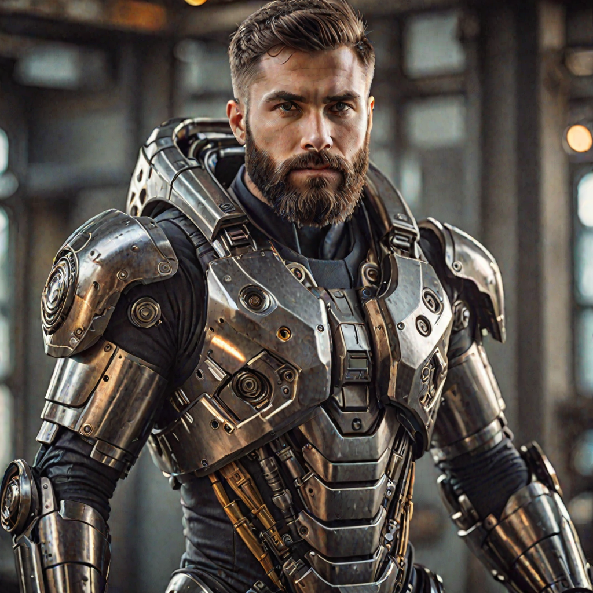

# Dreamshaper-XL-Lightning Cog model

This is an implementation of the [Lykon/dreamshaper-xl-lightning](https://huggingface.co/Lykon/dreamshaper-xl-lightning) as a Cog model. [Cog packages machine learning models as standard containers.](https://github.com/replicate/cog)

Run a prediction:

    cog predict -i prompt="portrait photo of muscular bearded guy in a worn mech suit, light bokeh, intricate, steel metal, elegant, sharp focus, soft lighting, vibrant colors"

## Example:

